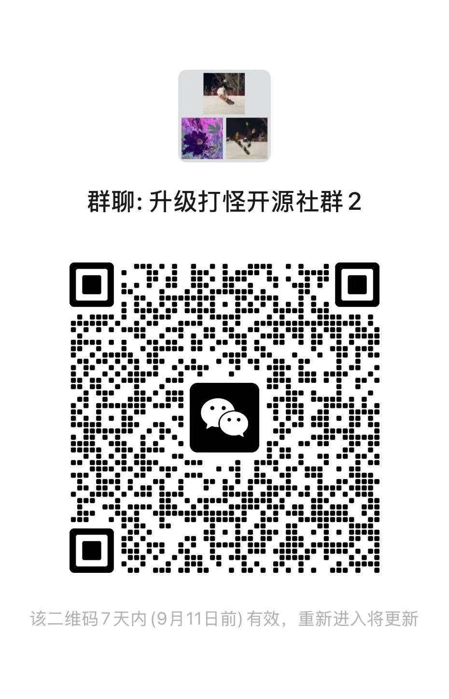

<!-- README_SYNC: source=working-tree; updated=2026-09-04 -->

  简体中文 · <a href="./README_EN.md">English</a>

<h1 align="center"><strong>升级打怪开源社区</strong></h1>

  <strong>面向普通人和非技术从业者的 AI 开源共建社区。</strong>

  <strong>借助 AI，把自己的想法、经验和真实需求做成教程、工具和开源项目。</strong>

  <strong>开放 · 创造 · 共建 · 成长</strong>

  ⭐ <a href="https://github.com/shengjidaguai-china"><strong>点击右上角 Follow 关注我们</strong></a>，及时获取新项目与共建活动。

  <a href="https://wcng30x0nvef.feishu.cn/wiki/M3DCwculsiyT5Tkc5YFcxYkunAd">社区资料库</a> ·
  <a href="#-如何参与">如何参与</a> ·
  <a href="#-近期活动">近期活动</a> ·
  <a href="#-首批开放共建项目">开放项目</a> ·
  <a href="#-加入社群">加入社群</a>

## 🧭 如何参与

| 参与方式 | 可以做什么 | 开始入口 |
| --- | --- | --- |
| **学习新手教程** | 用 7 天了解如何借助 AI 完成自己的第一个项目 | [学习本期 7 天新手教程](https://my.feishu.cn/wiki/XTgmwIPdeiGQ6okwdRpcuprOnUf) |
| **参与开源项目** | 从一个小任务开始，通过代码、产品、设计、测试、文档或内容参与共建 | [选择项目并查看参与规则](../CONTRIBUTING.md) |
| **成为项目维护者** | 持续维护项目，处理 Issue、审核 PR、完善内容并推动更新 | [查看维护者要求并申请](../MAINTAINERS.md) |
| **发起自己的项目** | 项目可以迁入升级打怪开源社区共同维护，也可以保留在原账号，以社区合作项目方式收录 | [查看收录与迁移规则](../COMMUNITY_PROJECTS.md#项目收录方式) · [提交申请](https://github.com/shengjidaguai-china/.github/issues/new?template=project-intake.yml) |
| **参与社区建设** | 共创课程、帮助新人、组织活动、建设网站与资料，或提供推广和物资支持 | [查看社区建设细则](../COMMUNITY_BUILDING.md) |

👥 持续参与后，可以受邀成为升级打怪开源社区正式成员。查看[社区正式成员加入与退出规则](../MEMBERSHIP.md)，了解成员身份、项目权限、公开成员和不活跃退出机制。

## 🔥 近期活动

### 社区项目收录中

有自己的开源项目？欢迎申请加入升级打怪开源社区，与社区伙伴一起持续共建。

[提交社区项目收录申请](https://github.com/shengjidaguai-china/.github/issues/new?template=project-intake.yml)

### 新手线上督学活动

跟着 7 天新手教程边学边做，在督学陪伴下完成自己的第一个 AI 项目。

[查看活动详情](https://my.feishu.cn/wiki/XTgmwIPdeiGQ6okwdRpcuprOnUf)

### 开源项目共建

从[社区项目清单](../COMMUNITY_PROJECTS.md)中选择感兴趣的项目，并提交 PR 参与共建。

## 🛠️ 首批开放共建项目

<table>
  <tr>
    <td width="50%"></td>
    <td width="50%"></td>
  </tr>
  <tr>
    <td width="50%"></td>
    <td width="50%"></td>
  </tr>
  <tr>
    <td width="50%"></td>
    <td width="50%"></td>
  </tr>
</table>

[查看完整共建项目清单](../COMMUNITY_PROJECTS.md)

## 👋 加入社群

欢迎加入升级打怪开源社区，参加新手共学、教程共创和真实项目共建。

  

当前二维码有效至 **2026 年 9 月 11 日**。二维码失效后，请联系管理员：

- Email：[247133278@qq.com](mailto:247133278@qq.com)
- WeChat：loonges
- QQ：247133278
